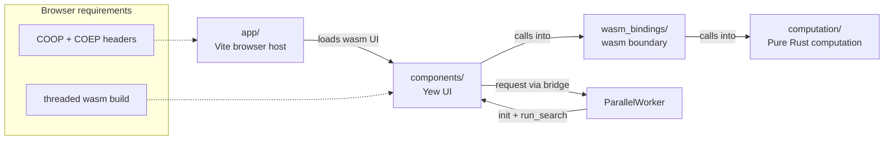

# orx-parallel wasm TSP yew

You can check, test, and play around with the built application at:
<https://orx-parallel-wasm-demo-tsp-yew.pages.dev/>

This example shows the recommended web structure for `orx-parallel` with a Yew UI hosted by Vite:

- `computation/` contains pure Rust TSP logic
- `wasm_bindings/` exposes a thin wasm API for that computation
- `components/` contains the Yew UI and calls into the wasm bindings
- `app/` is the browser app that builds, serves, and boots the generated wasm package

The same structure works for other parallelizable Rust workloads too. The important part is the separation: keep the algorithm in Rust, keep the wasm layer thin, keep the Yew UI focused on orchestration and presentation, and keep the browser app responsible for hosting and bootstrapping.

For the practical build flow, jump to [Building a browser UI with `orx-parallel`](#building-a-browser-ui-with-orx-parallel).

## Project responsibilities

### `computation/`

This crate contains the actual TSP implementation. It is the best place to add benchmarks, unit tests, and algorithm changes.

Use this crate for anything that should stay independent from the web platform:

- instance generation
- tour construction and improvement
- sequential and parallel search strategies

### `wasm_bindings/`

This crate is the boundary between pure computation and wasm consumers. It should stay thin.

Its job is to:

- expose computation functions such as `locations` and `run_search`
- serialize and deserialize values at the edge
- compile the computation for the browser through the `orx-parallel-wasm` integration

### `components/`

This crate contains the Yew UI. It renders the page, owns UI state, and calls into JavaScript for the worker lifecycle.

The UI should call into the wasm package, but it should not reimplement TSP logic or bypass the wasm boundary.

### `app/`

This is the browser host application. It owns the Vite setup, static assets, CSS, and TypeScript entrypoints.

Its job is to:

- build the `components/` crate into `app/pkg`
- load the generated wasm package in the browser
- expose the TypeScript worker bridge used by the Yew UI
- serve the app with the required cross-origin isolation headers

## Execution flow

1. The browser loads `app/src/main.ts`.
2. `main.ts` initializes the generated wasm package from `app/pkg/components.js` and calls `start_app()`.
3. The Yew UI in `components/` creates or loads a TSP instance.
4. When the user starts a search, the UI calls the TypeScript bridge exposed by `app/src/search-runner.ts`.
5. The bridge sends the request through `ParallelWorker` from `orx-parallel-wasm`.
6. `ParallelWorker` initializes the generated wasm package and runtime in its persistent worker.
7. The worker runs `run_search` and returns the result through the bridge to the Yew UI.

The app reuses one worker across searches and terminates it when the page unloads. Runtime initialization is managed by `ParallelWorker`.

## Important rules for parallel wasm on the web

Parallel wasm in the browser requires a threaded wasm build and cross-origin isolation. The `orxParallelWasm` Vite plugin configures the local development server and generated worker setup.

### 1. Build wasm with thread support enabled

Use `npm run build:wasm` in `app/` after changing Rust code. The script delegates the threaded build to `orx-parallel-wasm`.

### 2. Serve the app with cross-origin isolation headers

Browser threads require `Cross-Origin-Opener-Policy: same-origin` and `Cross-Origin-Embedder-Policy: require-corp`. The Vite plugin supplies them in development; production hosting must supply them too.

### 3. Use the worker integration for runtime setup

The app's `ParallelWorker` owns wasm and runtime initialization. If you create additional workers outside that integration, each worker needs its own wasm/runtime setup.

## Testing strategy

The separation also makes testing straightforward:

- test the algorithm in `computation/` with ordinary Rust tests
- test the wasm boundary in `wasm_bindings/`
- test UI behavior in `components/`
- test browser bootstrapping and worker integration in `app/`

That division is deliberate. It lets you validate the core search independently from the browser and only use wasm tests where they are actually needed.

## Read next

- [computation README](./computation/README.md)
- [wasm bindings README](./wasm_bindings/README.md)
- [components README](./components/README.md)
- [app README](./app/README.md)

The `app/README.md` contains the exact setup and run commands for the browser app, while `wasm_bindings/README.md` documents the wasm API surface.

## Building a browser UI with `orx-parallel`

1. Decide what should stay in Rust.

   Put the pure-Rust computation in `computation/`. Keep it independent from the browser so it can be tested and benchmarked as a normal Rust crate.

   This layer may expose many functions: some may use parallel execution, others may stay sequential, but none of them should depend on UI, DOM, or JavaScript concerns.

2. Expose only a thin wasm API.

   Add `wasm_bindings/` as the bridge between Rust and JavaScript. Expose the computation functions needed by the UI; let the `orx-parallel-wasm` integration handle threaded worker setup.

3. Build the UI around a Rust UI layer plus a browser host.

   Let the interactive UI live in `components/`, and let `app/` host that generated wasm package in the browser. The UI should orchestrate when and how computations are triggered, not reimplement them.

   In this example, the Yew UI calls a small TypeScript bridge that owns the worker lifecycle. That keeps browser-specific bootstrapping in `app/` while keeping the UI itself in Rust.

4. Enable browser threads in the build.

   Compile the wasm package with the threaded configuration from `app/package.json` and the Rust feature wiring in `computation/`, `wasm_bindings/`, and `components/`. If the build is not thread-enabled, the parallel path will not actually run in parallel.

5. Make sure the app is served with cross-origin isolation.

   Use Vite or another server that sends `Cross-Origin-Opener-Policy` and `Cross-Origin-Embedder-Policy` headers. Without them, the browser cannot use `SharedArrayBuffer`, so threaded wasm will fail.

6. Use the worker integration to initialize wasm before running search.

   Use `ParallelWorker` from `orx-parallel-wasm` to load the generated bindings and prepare the runtime. The same worker can then run repeated computations.

7. Pass data through the wasm boundary in a simple shape.

   Generate or load the input data in the UI, send it to the wasm function you need, and return the result back to the UI. Keep the exchanged data small and explicit so the boundary stays easy to reason about.

8. Tune execution settings from the UI.

   Expose thread count and other tuning knobs as user-facing settings if you need them. Good values depend on the workload and browser, so start modestly and measure before increasing them.

9. Test each layer independently.

   Verify the Rust computation with ordinary Rust tests, verify the wasm boundary in `wasm_bindings/`, verify the Yew UI behavior in `components/`, and verify the browser integration in `app/`. This is the main advantage of the four-project layout.

10. Keep the architecture strict.

    Do not move computation logic into the UI, do not let the computation crate depend on DOM APIs, and do not turn the wasm bindings into a second implementation layer. The example stays reliable only if each project keeps its role.
